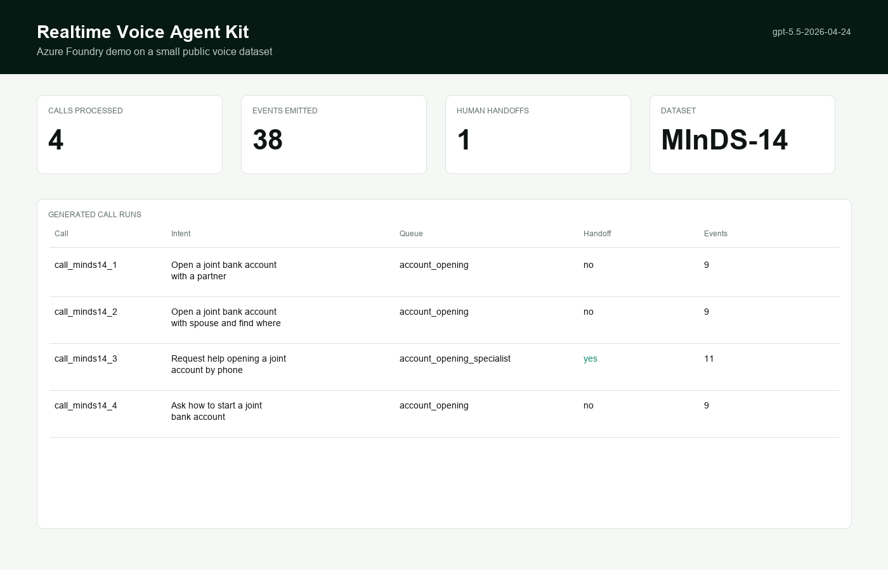
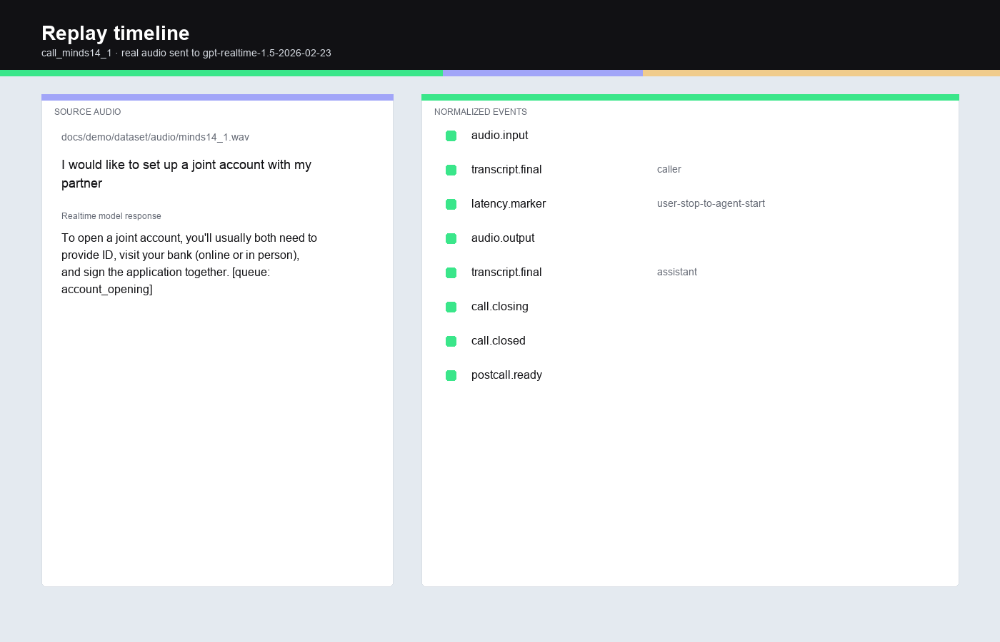
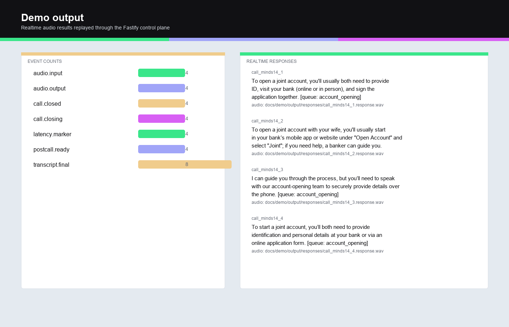
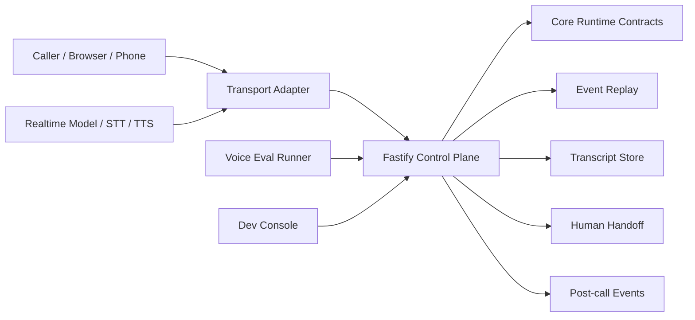

This is a starter kit for implementing Realtime Voice AI applications handling: interruptions, handoff, tool calls, transcript consistency, post-call events, replay, and regression tests.

It is based in TypeScript for production voice agents across WebRTC, telephony, realtime model APIs, STT/TTS pipelines, barge-in, human handoff, evals, and post-call workflows.

## Demo

This demo uses a small sample from [PolyAI/minds14](https://huggingface.co/datasets/PolyAI/minds14), a CC BY 4.0 spoken banking dataset. The script streams the WAV audio clips to an Azure OpenAI Realtime deployment (`gpt-realtime-1.5`), saves the model's audio replies, then replays concise normalized events through the local Fastify control plane.

This is the real audio path: WAV file -> PCM16 -> Azure Realtime WebSocket -> model audio output -> normalized event replay.







Video with realtime model audio:

[Watch the MP4 walkthrough](docs/demo/realtime-voice-agent-demo.mp4)

<video src="docs/demo/realtime-voice-agent-demo.mp4" controls></video>

Listen to the combined model output:

[Combined realtime output WAV](docs/demo/output/realtime-output.wav)

<audio src="docs/demo/output/realtime-output.wav" controls></audio>

Direct files:

- `docs/demo/realtime-voice-agent-demo.mp4`
- `docs/demo/output/realtime-output.wav`
- `docs/demo/output/responses/*.wav`
- `docs/demo/azure-foundry-demo.md`
- `docs/demo/azure-foundry-demo.json`
- `docs/demo/output/replays.json`

Run it again:

```bash
AZURE_AI_RESOURCE_GROUP=<resource-group> \
AZURE_AI_RESOURCE_NAME=<foundry-resource-name> \
OPENAI_BASE_URL=https://<resource>.services.ai.azure.com/openai/v1 \
AZURE_OPENAI_REALTIME_DEPLOYMENT=gpt-realtime-1.5 \
npm run demo:azure
```

## Why This Exists

Teams building voice AI usually hit the same problems:

- OpenAI Realtime or Gemini Live works in a small demo, then the app needs Twilio, SIP, LiveKit, or browser WebRTC.
- The first interruption breaks the turn model.
- Tool calls get mixed into transcript text.
- Handoff loses the transcript pointer.
- Post-call summaries run on partial transcripts.
- Nobody can replay what happened when latency spikes.

This repo gives you the boring control layer up front.

## What You Get

- **Provider-neutral voice events** for audio, transcripts, tools, handoff, latency, and post-call output.
- **Fastify control plane** with call start, event ingestion, handoff, transcript, replay, webhook, and WebSocket routes.
- **Reusable core package** with session state, runtime definitions, turn policy, handoff policy, transcript model, event sinks, and tool definitions.
- **Adapter package** for OpenAI Realtime, Azure OpenAI Realtime, Gemini Live, Twilio Media Streams, LiveKit, Deepgram, ElevenLabs, Cartesia, AssemblyAI, and a fake/local adapter.
- **Eval package** with eight default regression scenarios for barge-in, no-response recovery, tool failure, handoff, duplicate events, latency, and post-call webhooks.
- **Local dev console** for inspecting a call timeline, transcript stream, tool calls, handoff state, latency markers, and post-call output.
- **Examples** for browser voice, phone calls, realtime model sessions, STT/TTS chains, and downstream post-call workflows.

## Install

```bash
npm install
npm run build
npm test
```

Run the control plane:

```bash
npm run dev
```

API base URL:

```text
http://127.0.0.1:8000
```

Run the local console in another terminal:

```bash
npm run dev:console
```

Console URL:

```text
http://127.0.0.1:3000
```

## Quickstart

Start a call:

```bash
curl -s http://127.0.0.1:8000/api/calls/start \
  -H 'content-type: application/json' \
  -d @examples/call-start.json
```

Stream a transcript event:

```bash
curl -s http://127.0.0.1:8000/api/calls/call_01JBRX2W2B5P4Z11/events \
  -H 'content-type: application/json' \
  -d @examples/realtime-event.json
```

Replay the call:

```bash
curl -s http://127.0.0.1:8000/api/calls/call_01JBRX2W2B5P4Z11/replay | jq
```

Run the default voice evals:

```bash
npm run eval
```

JSON output:

```bash
npm run eval -- --json
```

## Public API

```ts
import { createVoiceRuntime, defineAgent, defineTool } from "@inferensys/realtime-voice";

const agent = defineAgent({
  name: "support-agent",
  instructions: "Resolve the caller's issue. Escalate when account verification is required.",
  tools: [
    defineTool({
      name: "lookup_order",
      schema: { orderId: "string" },
      handler: async ({ orderId }) => ({ status: "shipped", eta: "Friday" })
    })
  ],
  handoff: {
    enabled: true,
    queues: ["billing", "support-specialist"]
  }
});

const runtime = createVoiceRuntime({
  agent,
  transport: "twilio-media-streams",
  model: "openai-realtime",
  turnPolicy: "interruptible",
  store: "memory"
});
```

## Architecture



The split is deliberate:

- Media adapters deal with provider-specific formats.
- The control plane owns state, sequence guards, idempotency, handoff, replay, and post-call flow.
- Core contracts keep app logic independent from Twilio, LiveKit, OpenAI, Deepgram, ElevenLabs, Cartesia, and the next provider that shows up.

## Packages

| Package | Purpose |
| --- | --- |
| `@inferensys/realtime-voice` | Core contracts, state machine, runtime helpers, session store |
| `@inferensys/realtime-voice-server` | Fastify HTTP/WebSocket control plane |
| `@inferensys/realtime-voice-adapters` | Provider event adapters |
| `@inferensys/realtime-voice-evals` | Voice eval scenarios and CLI |
| `@inferensys/realtime-voice-dev-console` | Local browser console |

## Provider Matrix

| Provider | Current support | Notes |
| --- | --- | --- |
| OpenAI Realtime | Event adapter | Audio, transcript, interruption, and tool-call event mapping |
| Azure OpenAI Realtime | Event adapter + WebSocket audio helper | Streams PCM16 audio to a realtime deployment and captures audio/transcript output |
| Gemini Live | Event adapter | Transcript, interruption, and output event mapping |
| Twilio Media Streams | Event adapter | Start, media, mark, and stop event mapping |
| LiveKit | Event adapter | Transcript and handoff-style event mapping |
| Deepgram | Event adapter | Streaming transcript event mapping |
| ElevenLabs | Event adapter | User transcript, agent response, and audio output mapping |
| Cartesia | Event adapter | Streaming TTS output mapping |
| AssemblyAI | Event adapter | Streaming transcript and redaction-friendly payload mapping |

These adapters normalize provider events into the kit’s event model. The examples show where to add provider credentials and session bootstrap code.

## HTTP And WebSocket Routes

| Route | Purpose |
| --- | --- |
| `POST /api/calls/start` | Create a call session |
| `POST /api/calls/:id/events` | Ingest normalized voice events |
| `POST /api/calls/:id/handoff` | Request human handoff |
| `GET /api/calls/:id/transcript` | Read committed transcript segments |
| `POST /api/calls/:id/postcall` | Emit post-call summary event |
| `GET /api/calls/:id/replay` | Replay events, transcript, tools, latency, and post-call output |
| `GET /api/calls` | List local sessions |
| `POST /api/webhooks/:provider` | Normalize provider webhook/event payloads |
| `WS /api/realtime/:provider` | Provider WebSocket entrypoint |

## Examples

Each example has an `.env.example`, README, and runnable entrypoint:

| Example | What it shows |
| --- | --- |
| `examples/browser-openai-realtime` | Browser WebRTC voice agent with server-side ephemeral Realtime sessions |
| `examples/twilio-openai-realtime` | Twilio Media Streams edge with normalized replay events |
| `examples/azure-openai-realtime` | Azure OpenAI Realtime audio-in/audio-out turn |
| `examples/gemini-live` | Gemini Live provider event mapping |
| `examples/livekit-room-agent` | LiveKit room transcript and handoff events |
| `examples/chained-pipeline` | Deepgram STT + OpenAI-style tool call + Cartesia TTS timeline |
| `examples/elevenlabs-agent-bridge` | ElevenLabs conversation event bridge |
| `examples/assemblyai-redaction` | AssemblyAI transcript events with redaction metadata |
| `examples/support-escalation` | Handoff request and accepted-agent flow |
| `examples/appointment-booking` | Tool call lifecycle for scheduling agents |
| `examples/postcall-webhook` | Closed-call summary and downstream webhook delivery |

Every path emits the same normalized event timeline, so you can swap providers without rewriting replay, evals, handoff, or post-call logic.

## Evals

The default suite covers:

- Standard intake
- Barge-in
- Silence timeout
- Duplicate event
- Slow model
- Tool failure
- Handoff
- Post-call webhook

Run:

```bash
npm run eval
```

Use evals in CI before changing prompts, providers, tools, or handoff policy.

## Work With Us

We build products like this for teams that want to integrate intelligence into their workflows.


Talk to [Inferensys](https://inferensys.com/) or contact us at [inferensys.com/contact](https://inferensys.com/contact).